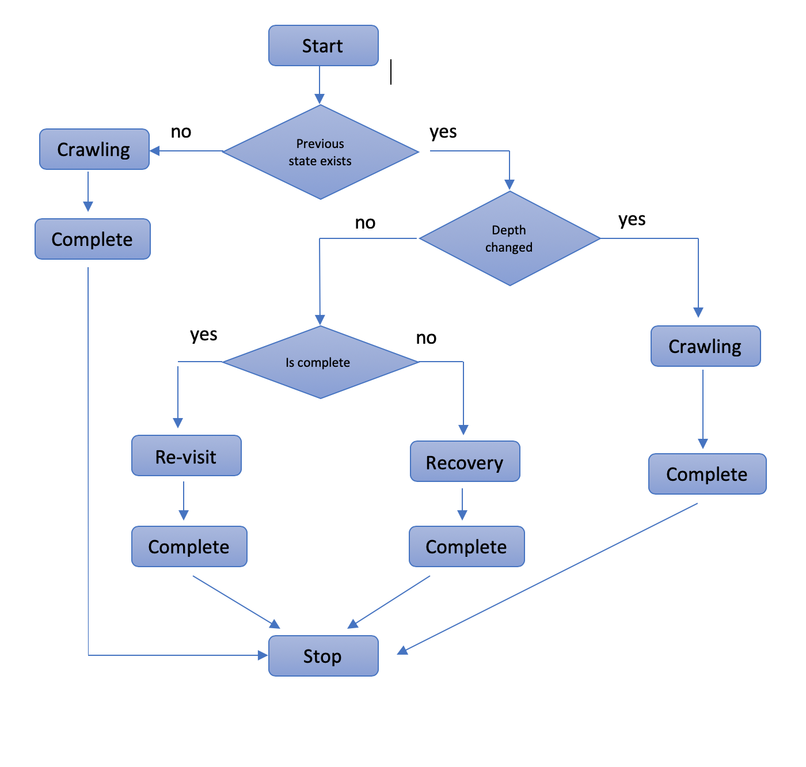

# Web Crawler
An Internet bot that knows to browse www to the predefine depth using Breadth-first search (BFS) approach.
The bot is designed generic enough which could easily be adjusted to the scalable distributed system. 
## System Requirements
* JDK 8 or later

## Quick start
Let's see how easily and quickly you can build and run Web Crawler

* [Crawler state design](#design)
* [Architecture](#architecture)  
* [Build](#build)
* [Run](#run)
* [JavaDoc](#javadoc)


## <a name="design"></a>Crawler State Design Overview
   
 The Crawler browsing process behaves as a stateful process which is 
 dictated by the following Finite-state machine.
 Each Crawler execution has to be completed if it does not happen, 
 the next execution will be running in the Recovery Mode. 
 
 
 
 
 ## <a name="architecture"></a>Architecture of Crawler
 
 The Crawler follows the High-level architecture of a standard Web crawler
 
 
 
 
 The current version uses the local FS for data preserving and in-memory cache for 
 better recovery and and efficient later re-visit.
 
  
## <a name="build"></a>Build Crawler

### Overview

 Crawler could be build as a JAR file which later might be usage in any java based system 

#### 1. Clone and build a jar file

Clone the repository using git tool, master branch has the latest code
   
#### 2. Run Build from CMD   

```bash
$ ./gradlew build 
```

The artifact crawler-app-#version#.jar will be located in `/build/libs` folder

## <a name="usage"></a>Run

#### 2. Run Crawler

### Overview
  The Crawler should be executed with two arguments in the following format
  
```bash
  usage: com.analyzary.crawler.CrawlerApplication 
 -r,--root <arg>    URL of the root page 
 -d,--depth <arg>   depth limit
```
  
### Sample
  
```bash
$ java -jar build/libs/crawler-app-1.0.0.jar -r https://www.lightricks.com -d 2 
```

The Crawler output file with pages domain ratio report
could be found in working directory, named as domain-ratio-report.tsv


## <a name="javadoc"></a>Java Doc
 
 [Crawler Java doc](https://denisvoloshin.github.io/crawler)
     
     
